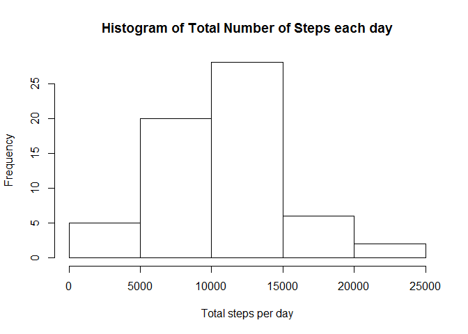

# Reproducible Research: Peer Assessment 1


## Loading and preprocessing the data.


```r
actData <- read.csv(unz("activity.zip", "activity.csv"))
```

## What is mean total number of steps taken per day?

```r
stepsPerDay<-tapply(actData$steps, actData$date, sum,na.rm = TRUE)
hist(stepsPerDay, xlab='Total steps per day', main='Histogram of Total Number of Steps each day')
```

 

```r
stepsMean<-mean(stepsPerDay)
stepsMedian<-median(stepsPerDay)
```
The mean of total number of steps per day is 9354.2295082.  
The median of total number of steps per day is 10395.

## What is the average daily activity pattern?
The average number of steps taken in each 5-minute interval across all the days is calculated and is plotted.


```r
step_average <- tapply(actData$steps, actData$interval, mean, na.rm = TRUE, simplify = TRUE)
plot(x = levels(as.factor(actData$interval)), y = step_average, type = "l", xlab = "time",
     ylab = "number of steps", main = "Average number of steps")
```

 

```r
maxAvg<-names(which.max(step_average))
```
The Interval which contains the maximum number of steps on average is 835.


## Imputing missing values

```r
nas <- sum(!complete.cases(actData$steps))
```
The total number of rows with NAs is 2304.

Fill in all of the missing values in the dataset using the mean of the interval


```r
actDataFinal <- actData
for (i in 1:length(actData$steps)) {
    if (is.na(actData$steps[i])) {
        for (j in 1:length(step_average)) {
            if (as.character(actData$interval[i]) == names(step_average[j])) 
                actData$steps[i] = step_average[j]
        }
    }
}
comp_data <- actData
```
Plot the total number of steps taken each day for the complete dataset using a histogram.


```r
comp_step_average <- tapply(comp_data$steps, comp_data$date, sum, na.rm = TRUE, simplify = TRUE)
hist(comp_step_average, xlab='Total steps per day', main='Histogram of Total Number of Steps each day')
```

 

```r
stepsCompMean<-mean(comp_step_average)
stepsCompMedian<-median(comp_step_average)
```
The mean of total number of steps per day is 1.0766189\times 10^{4}.  
The median of total number of steps per day is 1.0766189\times 10^{4}.

There is a slight difference in the mean value but The median value have no difference.From the histogram it is evident that the number of steps per day increases a little bit when the NA values are filled in 

## Are there differences in activity patterns between weekdays and weekends?
A New factor variable dayType is created.

```r
comp_data$dayType <-  ifelse(as.POSIXlt(comp_data$date)$wday %in% c(0,6), 'weekend', 'weekday')
```
Calculate the average activity for plotting

```r
comp_data_avg <- aggregate(steps ~ interval + dayType, data=comp_data, mean)
library(ggplot2)
ggplot(comp_data_avg, aes(interval, steps)) + 
    geom_line() + 
    facet_grid(dayType ~ .) +
    xlab("5-minute interval") + 
    ylab("avarage number of steps")
```

 
